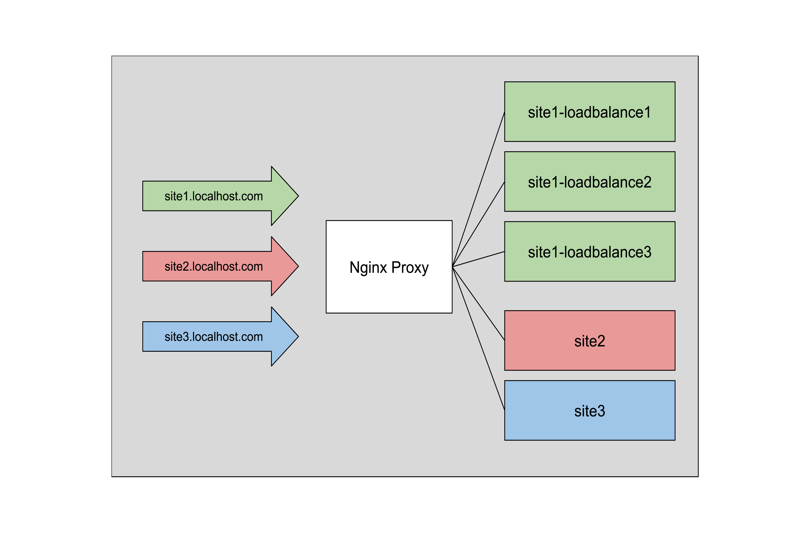

# 🔀 Reverse Proxy with NGINX, Load Balancing & Multiple Domains

A practical Docker Compose project for learning how to set up **NGINX as a reverse proxy**, **load balancer**, and support for **multiple domains** under a single IP address.

---

## 📌 About

This project demonstrates a basic infrastructure setup using:

- **NGINX** for reverse proxy and load balancing
- **Docker Compose** to orchestrate multiple services
- **Multiple domain support** (e.g., site1.localhost.com, site2.localhost.com)
- **PHP-FPM support** for PHP-based web applications



---

## 🧪 Purpose

The goal is to provide a simple yet functional environment to study:

- Reverse proxy configuration
- Load balancing between containers
- Hosting multiple domains on one IP
- Forwarding real client IPs from NGINX to containers

> ⚠️ This is not production-ready. It’s built for study and experimentation.

---

## 🧭 Domain Configuration

You need to point the following addresses to the IP of your host machine.  
If you're running Docker locally, use `localhost` as the IP.

```
    127.0.0.1	    localhost
    ::1             localhost
    192.168.70.10   site3.localhost.com
    192.168.70.10   site2.localhost.com
    192.168.70.10   site1.localhost.com
``` 
## 🚀 Usage

1. Clone the repository:

```bash
git clone https://github.com/yourusername/nginx-multi-domain-lb.git
cd nginx-multi-domain-lb
```
2. Start the containers:

bash
Copy
Edit

```
docker-compose up -d
```

